# Splunk SOC Lab

## Overview

This project documents the creation of a Security Operations Center (SOC) lab using Splunk Enterprise, Windows Security Event Logs, and Sysmon.

The goal of this lab is to simulate basic SOC analyst activities including:

* Log collection
* Event monitoring
* Threat hunting
* Security investigations
* Detection engineering
* Alert creation
* Dashboard creation
* Windows Security Event analysis
* Sysmon event monitoring

---

## Environment

| Component | Details |
|------------|------------|
| SIEM | Splunk Enterprise 10.4 |
| Endpoint | Windows 11 |
| Data Source | Windows Security Event Logs |
| Additional Telemetry | Sysmon |
| Log Type | WinEventLog:Security |
| Sysmon Sourcetype | XmlWinEventLog:Microsoft-Windows-Sysmon/Operational |

---

## Data Collection

Windows Security Event Logs were ingested into Splunk using Local Event Log monitoring.

Collected Windows Security Events include:

* Successful Logons (4624)
* Failed Logons (4625)
* Privileged Logons (4672)
* User Account Creation (4720)
* Security Auditing Events

Additionally, Sysmon was deployed to provide enhanced endpoint visibility for:

* Process Creation
* Network Connections
* File Creation
* Process Relationships
* Command Line Monitoring

---

# Windows Security Event Monitoring

## Failed Logons Detection

Detects unsuccessful authentication attempts.

```spl
index=* sourcetype="WinEventLog:Security" EventCode=4625
| stats count by Account_Name
| sort -count
```

**MITRE ATT&CK:** T1110 - Brute Force

---

## User Account Creation Detection

Detects creation of new local user accounts.

```spl
index=* EventCode=4720
```

**MITRE ATT&CK:** T1136 - Create Account

---

## Privileged Logons Detection

Detects logons receiving elevated privileges.

```spl
index=* EventCode=4672
| stats count by Account_Name
| sort -count
| head 10
```

**MITRE ATT&CK:** T1078 - Valid Accounts

---

## Top 10 Security Event IDs

Displays the most common Windows Security Events.

```spl
index=* sourcetype="WinEventLog:Security"
| stats count by EventCode
| sort -count
| head 10
```

---

## Dashboards

### SOC Security Overview

Current dashboard panels:

* Failed Logons Detection
* User Account Creation Detection
* Privileged Logons Detection
* Top 10 Security Event IDs

---

## Security Event Screenshots

### Failed Logons Detection

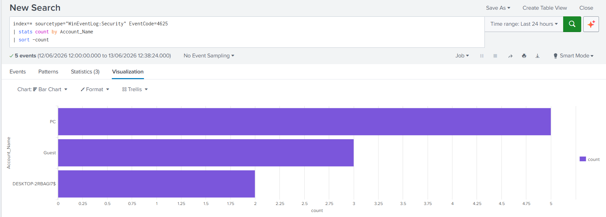

### User Account Creation Detection

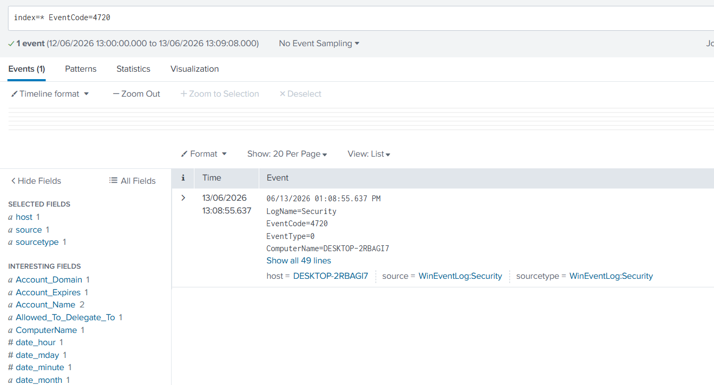

### Privileged Logons Detection

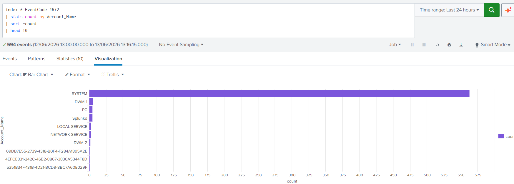

### Top 10 Security Event IDs

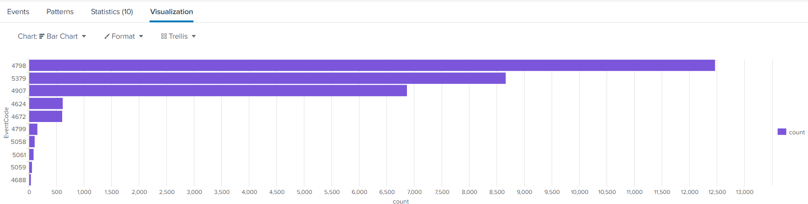

### Windows Security Event Distribution

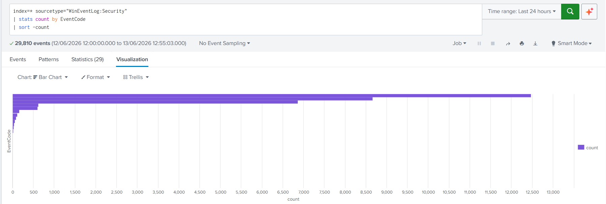

---

# Sysmon Threat Hunting

Sysmon was deployed to enhance endpoint visibility and provide advanced process, file, and network monitoring capabilities.

## Sysmon Data Source

| Component | Details |
|------------|------------|
| Source | Microsoft-Windows-Sysmon/Operational |
| Sourcetype | XmlWinEventLog:Microsoft-Windows-Sysmon/Operational |
| Collection Method | Local Event Log Collection |
| Index | main |

---

## Sysmon Event ID Distribution

This search extracts Sysmon Event IDs from XML logs and summarizes the most common Sysmon events.

```spl
index=* sourcetype="XmlWinEventLog:Microsoft-Windows-Sysmon/Operational"
| rex "<EventID>(?<SysmonEventID>\d+)</EventID>"
| stats count by SysmonEventID
| sort SysmonEventID
```


---

## Process Creation Monitoring

Monitor newly created processes using Sysmon Event ID 1.

```spl
index=* sourcetype="XmlWinEventLog:Microsoft-Windows-Sysmon/Operational"
| rex "<EventID>(?<SysmonEventID>\d+)</EventID>"
| search SysmonEventID=1
```

**MITRE ATT&CK:** T1059 - Command and Scripting Interpreter

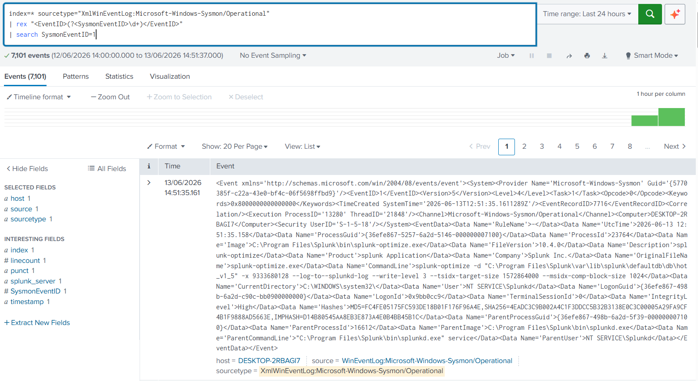

---

## PowerShell Execution Detection

Detect execution of PowerShell commands.

```spl
index=* sourcetype="XmlWinEventLog:Microsoft-Windows-Sysmon/Operational"
| search "powershell.exe"
```

**MITRE ATT&CK:** T1059.001 - PowerShell

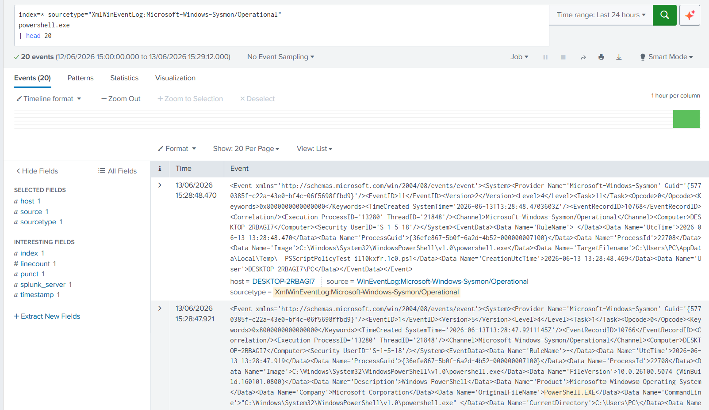

---

## Command Prompt Execution Detection

Detect execution of cmd.exe.

```spl
index=* sourcetype="XmlWinEventLog:Microsoft-Windows-Sysmon/Operational"
| search "cmd.exe"
```

**MITRE ATT&CK:** T1059.003 - Windows Command Shell

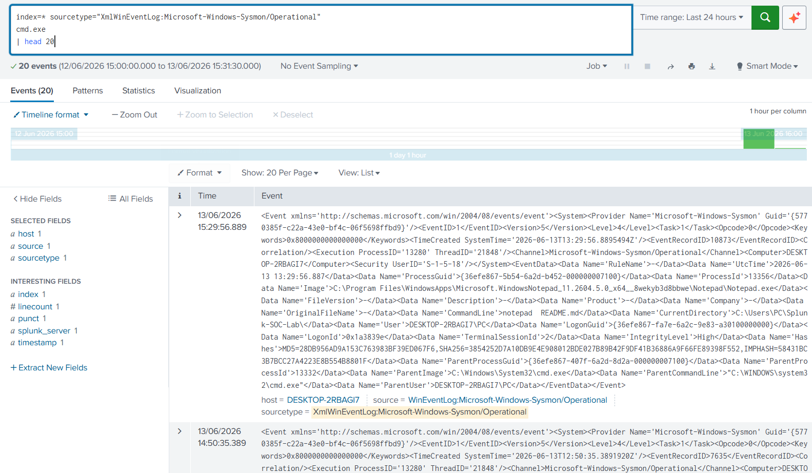

---

## Network Connection Monitoring

Monitor outbound network connections using Sysmon Event ID 3.

```spl
index=* sourcetype="XmlWinEventLog:Microsoft-Windows-Sysmon/Operational"
| rex "<EventID>(?<SysmonEventID>\d+)</EventID>"
| search SysmonEventID=3
```

**MITRE ATT&CK:** T1049 - System Network Connections Discovery

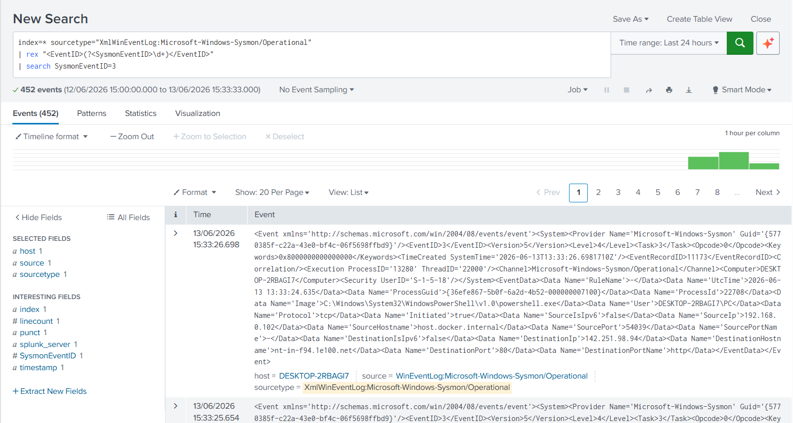

---

## File Creation Monitoring

Detect file creation activity using Sysmon Event ID 11.

```spl
index=* sourcetype="XmlWinEventLog:Microsoft-Windows-Sysmon/Operational"
| rex "<EventID>(?<SysmonEventID>\d+)</EventID>"
| search SysmonEventID=11
```

**MITRE ATT&CK:** T1105 - Ingress Tool Transfer

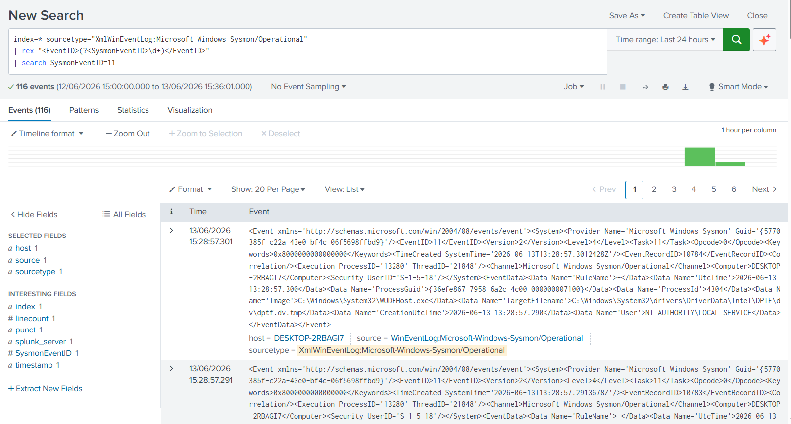

---

## Splunk Alert: PowerShell Execution Detection

A scheduled Splunk alert was created to detect PowerShell execution events.

Alert configuration:

* Alert Type: Scheduled
* Schedule: Hourly
* Trigger Condition: Number of Results > 0
* Action: Add to Triggered Alerts
* Severity: Medium

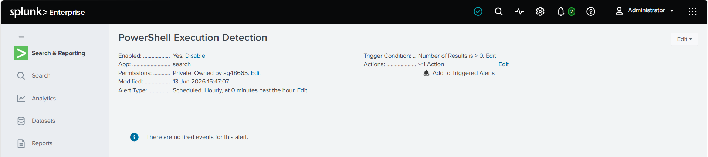

---
### Splunk Alert: CMD Execution Detection

A scheduled Splunk alert was created to detect command prompt execution events.

Alert configuration:

* Alert Type: Scheduled
* Schedule: Hourly
* Trigger Condition: Number of Results > 0
* Action: Add to Triggered Alerts

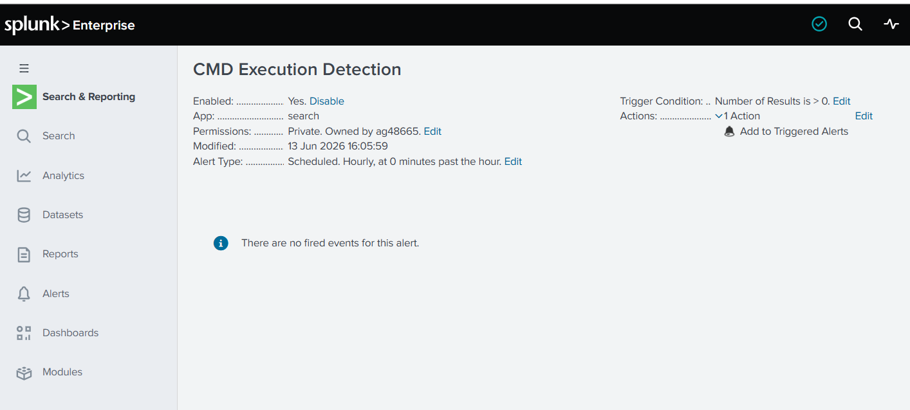
---


## Skills Demonstrated

* Splunk Enterprise Administration
* Windows Event Log Analysis
* Sysmon Deployment and Monitoring
* SPL (Search Processing Language)
* Security Monitoring
* Threat Hunting
* Detection Engineering
* Alert Creation
* Dashboard Development
* SIEM Operations
* MITRE ATT&CK Mapping
* Incident Detection

---

## Future Improvements

* Create additional Sysmon alerts
* Develop correlation searches
* Integrate Sigma rules
* Build custom SOC dashboards
* Create phishing detection use cases
* Develop brute-force detection playbooks
* Add MITRE ATT&CK coverage matrix
* Simulate attack scenarios using Atomic Red Team
* Implement incident response workflows